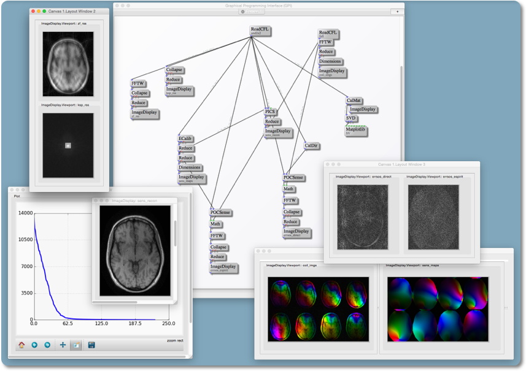

# [GPI](http://gpilab.com)-BART Nodes
This directory contains node wrappers for the BART toolbox binaries so that
they can be used natively in GPI ([gpilab.com](http://gpilab.com)). This fork 
turns the base BART directory into a python library with 'gpi' and 'python'
sub-libraries.  To install this as a GPI node-library, clone the repository
from github as 'bart' in your local GPI node directory:

    $ mkdir ~/gpi
    $ cd ~/gpi
    $ git clone https://github.com/nckz/bart.git bart

Then follow the instructions for installing dependencies and making the BART
toolbox for your platform.

    $ less ~/gpi/bart/README

# Examples
The *example1_espirit_recon_py2_GPI.net* (found [here](https://github.com/nckz/bart/blob/master/gpi/))
is a GPI network that matches the *example #1* on the [BART examples page](http://mikgroup.github.io/bart/examples.html).
The data for this network can be found on the [ESPIRiT data page](https://github.com/mikgroup/espirit-matlab-examples/tree/master/data).
This example makes use of the *und2x2* and *full* datasets.

